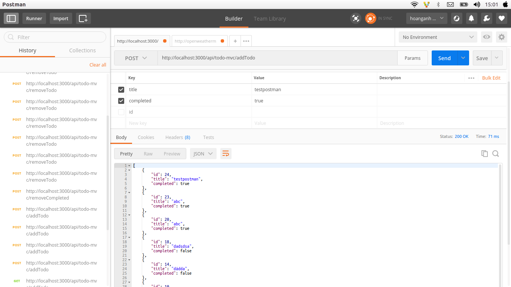

# vue-todo

> Vue TodoMVC demo with database 
## Ứng dụng này sử dụng vue ,axios.
## Build Setup

``` bash
# install dependencies
npm install

# serve with hot reload at localhost:8080
npm run dev

# build for production with minification
npm run build

# build for production and view the bundle analyzer report
npm run build --report
```
* Giới thiệu qua cấu trúc font-end của Vue-TodoMVC :
  * Ứng dụng này được làm bắng vue nên nó sẽ bao gồm :
    * Thư mục assets : sẽ chứa các thứ như file ảnh , file js ,...
    * Thư mục components : chứa các file có đuôi vue dùng đề hiển thị ra màn hình và các file này có thể sử dụng lại được với nhau 
    * Thư mục router : Chứa đường dẫn hiện thị trên thanh url của trình duyệt.
* Chức năng của ứng dụng là nhập dữ liệu qua ô input và  sau đó dữ liệu sẽ được thêm vào database.
For detailed explanation on how things work, checkout the [guide](http://vuejs-templates.github.io/webpack/) and [docs for vue-loader](http://vuejs.github.io/vue-loader).

# Đổi Vue TodoMVC sang cấu trúc của Vuecli
* Tách thành `Todo` và `Footer` components
### Todo Component
* Route: `/todo-mvc/:status` với status là `all`, `active`, `completed`. Đổi từ thẻ `<a>` sang `<router-link>`

```js
// src/router/index.js
// khai báo route vào todo-mvc
import Todo from '@/components/Todo'
Vue.use(Router)

export default new Router({
  routes: [
    {
      path: '/',
      name: 'Hello',
      component: Hello
    },
    {
      path: '/todo-mvc/:status',
      name: 'Todo',
      component: Todo
    }
  ]
})
```

```html
// src/components/Todo.vue
<li><router-link :to="{name: 'Todo', params: {status: 'all'}}" :class="{ selected: visibility == 'all' }">All</router-link></li>
<li><router-link :to="{name: 'Todo', params: {status: 'active'}}" :class="{ selected: visibility == 'active' }">Active</router-link></li>
<li><router-link :to="{name: 'Todo', params: {status: 'completed'}}" :class="{ selected: visibility == 'completed' }">Completed</router-link></li>
```

* Vì tất cả các routes `/todo-mvc/:status` đều dùng chung components nên khi routes thay đổi vì component này cũng không đc render lại. Để theo dõi routes và hiển thị dữ liệu chính xác, ta có `watch` biến `$route`
* Trong file components sẽ có file Todo.vue 
  * Trong file Todo :
    * Nếu bình thường khi code html ta sẽ tạo ra số thể li cố định và nếu muốn thêm thẻ li ta phải vào code để thêm khiến rất bất tiện nên khi ta dùng vue thì số thể li sẽ động và tự thêm vào khi ta nhập dữ liệu từ ô input ví dụ như trong đoạn code dưới đây sẽ c
    ó  **v-for="todo in filteredTodos"** dùng để in ra các giá trị có trong 1 mảng và phân loại theo yêu cầu  giống như tabs trong boostrap vậy
    
    
```script
   <section class="main" v-show="todos.length" v-cloak>
            <input class="toggle-all" type="checkbox" v-model="allDone"> //v-model : tạo ra two-way binding giữa input và state của app có nghĩa là khi ta nhập dữ liệu  abc và othẻ input 1 và ấn enter thì thẻ input 2 sẽ nhận được dữ liệu thêm là abc  
            <ul class="todo-list">
              <li v-for="todo in filteredTodos" class="todo" :key="todo.id" :class="{ completed: todo.completed, editing: todo == editedTodo }">
                <div class="view">
                  <input class="toggle" type="checkbox" @click="completeTodo(todo)">
                  <label @dblclick="editTodo(todo)">{{ todo.title }}</label> //todo.title dùng để lấy giá trị trong cơ sở dữ liệu 
                  <button class="destroy" @click="removeTodo(todo.id)"></button>
                </div>
                <input class="edit" type="text" v-model="todo.title" v-todo-focus="todo == editedTodo" @blur="doneEdit(todo)" @keyup.enter="doneEdit(todo)"
                  @keyup.esc="cancelEdit(todo)"> // có chức năng khi click chuột vào thể input ta có thể sửa và cập nhập lại 
              </li>
            </ul>
      </section>
```      
   * Code tạo chức năng filters
   
   ````
    
        <ul class="filters">
                  <li>
                    <router-link :to="{name: 'Todo', params: {status: 'all'}}" :class="{ selected: visibility == 'all' }">All</router-link>
                  </li>
                  <li>
                    <router-link :to="{name: 'Todo', params: {status: 'active'}}" :class="{ selected: visibility == 'active' }">Active</router-link>
                  </li>
                  <li>
                    <router-link :to="{name: 'Todo', params: {status: 'completed'}}" :class="{ selected: visibility == 'completed' }">Completed</router-link>
                  </li>
                </ul>
    
   ````  
   
   ````
       data() {
            return {
              todos: [],
              newTodo: '',
              editedTodo: null,
              visibility: 'all',
              filters: null,
              user: '',
              showTodo: false
            }
          },
          created() {
            // visibility filters
            this.filters = {
              all: function (todos) {
                return todos
              },
              active: function (todos) {
                return todos.filter(function (todo) {
                  return !todo.completed
                })
              },
              completed: function (todos) {
                return todos.filter(function (todo) {
                  return todo.completed
                })
              }
            }
   ````
   * Code lấy dữ liệu từ data sử dụng thư viện axios :
   
      * **Thêm dữ liệu :** 
      
      ````
         addTodo: function () {
                var value = this.newTodo && this
                  .newTodo
                  .trim()
                if (!value) {
                  return
                }
                axios.post('http://localhost:3000/api/todo-mvc/addTodo', { //lấy url từ server khi request lên 
                    title: value,
                    completed: false
                  })
                  .then(res => { // trả về data json
                    // this.todos.push(res.data[0])
                    this.todos = res.data
                    this.newTodo = ''
                  })
                  .catch(err => {
                    console.log(err)
                  })
              }
      ````
      * **Sửa dữ liệu :**
      
        ````
        
          editTodo: function (todo) {
            this.beforeEditCache = todo.title
            this.editedTodo = todo
          },
    
          doneEdit: function (todo) {
            if (!this.editedTodo || !this.editedTodo.title) {
              // todo.title = this.beforeEditCache
              return
            }
            axios.post('http://localhost:3000/api/todo-mvc/editTodo', {
                todo
              })
              .then(res => {
               
                this.todos = res.data
                this.editedTodo = null
              })
              .catch(err => {
                console.log(err)
              })
          }
          cancelEdit: function (todo) {
                  this.editedTodo = null
                  todo.title = this.beforeEditCache
               }
        ````
      * **Xóa dữ liệu :**   
      ````
          removeCompleted: function () {
                  axios.post('http://localhost:3000/api/todo-mvc/removeCompleted', {
                      completedTodos: this.filters.completed(this.todos)
                    })
                    .then(res => {
                      
                      this.todos = res.data
                    })
                    .catch(err => {
                      console.log(err)
                    })
                }
              }
      ````
   * Thêm , xóa ở trạng thái completeTodo :
      * Thêm :
      
      ````
        completeTodo: function (todo) {
                //todo.completed = !todo.completed
                axios.post('http://localhost:3000/api/todo-mvc/completeTodo', {
                    todo
                  })
                  .then(res => {
                    this.todos = res.data
                    this.editedTodo = null
                  })
                  .catch(err => {
                    console.log(err)
                  })
              }
      ````
      
        * Xóa : 
        ````
          removeCompleted: function () {
              axios.post('http://localhost:3000/api/todo-mvc/removeCompleted', {
                  completedTodos: this.filters.completed(this.todos)
                })
                .then(res => {
                 
                  this.todos = res.data
                })
                .catch(err => {
                  console.log(err)
                })
            }
        ````
      
  * Để hiểu phương thức post thì ta dùng postman của chrome để kiểm tra:
    *   Chỉ cần vào đường [guide] https://chrome.google.com/webstore/detail/postman/fhbjgbiflinjbdggehcddcbncdddomop?hl=vi ấn cài đặt.
    *  Sau đó dán url của post vào ví dụ : để test chức năng thêm ta sẽ copy và dán url này vào post http://localhost:3000/api/todo-mvc/addTodo và vào body chọn **x-www-form-urlencoded**.
    * Trong phần key cần thêm nhưng key ở trong back-end ví dụ ở đây để thêm ta sẽ viết key : title và completed
      
      ````
          let title1 = req.body.title;
          let completed1 = req.body.completed;
          
      ````
    * Sau đó ấn send thì nó sẽ tạo ra 1 mảng bao gồm object :
     
